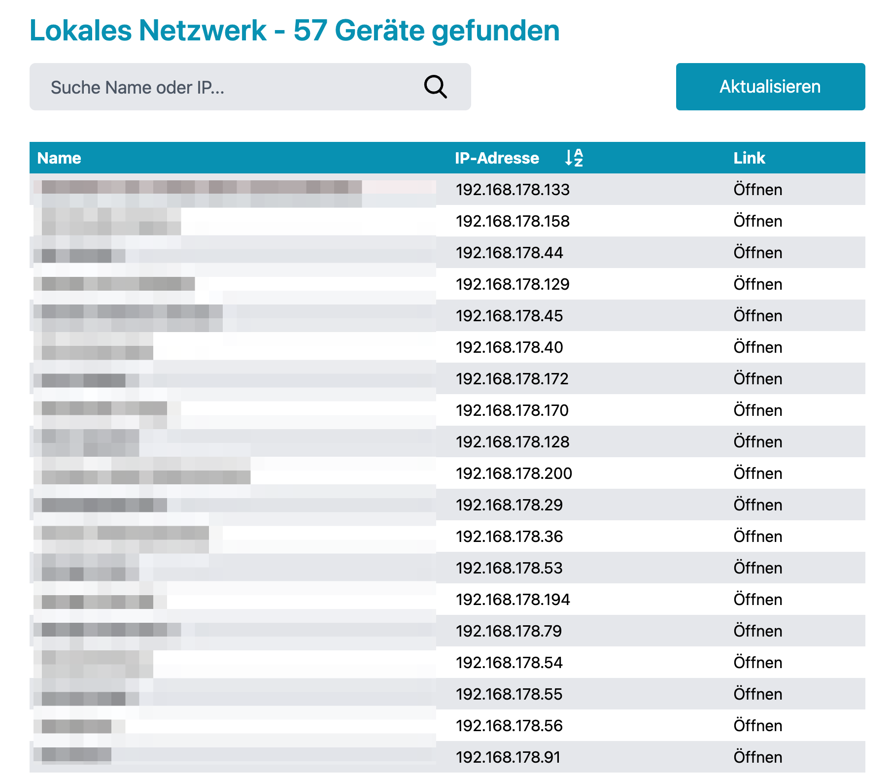

# lan-list-client-vite

## Installation

- run `npm install` (Node 14 or yarn)
- run `npm start`

## Description

- Vue 3 App with Tailwind CSS
- shows all clients on the current local network in which the API is started in (see Screenshot)
- easy and fast, needed it to check newly added ESP8266 devices like Sonoffs, Shellys or other IoT Devices, my Fritzbox is so slooooow
- intended for local use in a private network
- the API's default config refreshed the network devices every 5 mins, but you can force a refresh via refresh the button

## Configuration

- `API_URL` and `REFRESH_URL` need to be set to the `lan-list-api`-API
- possible LAN solution: use `nginx` on raspberry and serve client and api for local network only

### [Corresponding API Link](https://github.com/holgerschillack/lan-list-api)

## Screenshot

